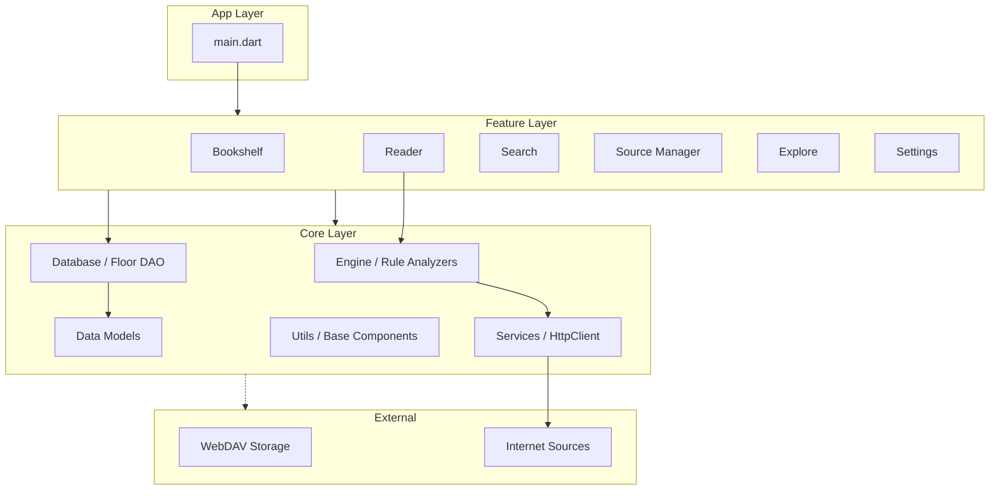

# Legado Reader iOS (Flutter) 專案架構分析報告

本報告詳細分析了 Legado Reader iOS (Flutter) 專案的軟體架構。該專案採用模組化的 Flutter 架構，旨在將 Android 端的 Legado 核心邏輯遷移至 iOS 平台，並提供現代化且高效的閱讀體驗。

---

## 🏗️ 總體架構圖

本專案遵循分層架構（Layered Architecture），將核心引擎、模型定義、資料持久化與業務功能模組化，確保高可維護性與靈活性。

---

## 📂 核心模組詳解

### 1. **Core Layer (基礎設施層)**
`lib/core/` 目錄下封裝了專案最核心的非視圖邏輯，是整個 App 的發動機。

*   **Engine (`lib/core/engine/`)**:
    *   **AnalyzeRule**: 負責解析書源規則，支援 XPath, Jsoup, JsonPath 等多種解析引擎。
    *   **JS Engine**: 提供嵌入式的 JavaScript 執行環境，用於處理複雜的動態規則。
    *   **WebBook**: 處理網頁書籍的抓取與內容提取邏輯。
*   **Database (`lib/core/database/`)**:
    *   使用 `floor` 套件實作持久化儲存，包含 `BookDao`, `BookSourceDao` 等實體。
*   **Models (`lib/core/models/`)**:
    *   定義全域數據實體（如 `Book`, `BookSource`, `Chapter`），對齊 Android 端的數據結構。
*   **Services (`lib/core/services/`)**:
    *   包含 HTTP 客戶端、快取管理器、Cookie 存儲與 WebDAV 同步邏輯。

### 2. **Feature Layer (功能業務層)**
`lib/features/` 採用 Feature-driven 結構，每個功能模組包含其專屬的 UI (Widgets)、Provider (State Management) 與業務邏輯。

*   **Reader (`lib/features/reader/`)**:
    *   核心閱讀介面，支援文本閱讀器與漫畫閱讀器 (`manga_reader_page.dart`)。
    *   集成換源功能 (`ChangeChapterSourceSheet`) 與語音朗讀 (Audio Player)。
*   **Bookshelf (`lib/features/bookshelf/`)**:
    *   書架管理，負責展示用戶已收藏的書籍。
*   **Source Manager (`lib/features/source_manager/`)**:
    *   管理所有的書源規則，支援導入、導出與規則診斷。
*   **Search/Explore**:
    *   跨來源搜尋書籍與目錄瀏覽。

### 3. **Shared Layer (共享組件層)**
`lib/shared/` 包含全域通用的 UI 組件、佈局工具與輔助函數，確保視覺表現的一致性。

---

## 🛠️ 技術棧彙總

| 領域 | 使用技術 / 套件 |
| :--- | :--- |
| **開發框架** | Flutter (Dart) |
| **狀態管理** | Provider |
| **持久化資料庫** | Floor (SQLite Wrapper) |
| **網路請求** | Dio |
| **解析引擎** | Jsoup, PetitParser, XML |
| **腳本引擎** | flutter_js |
| **架構模式** | Layered Architecture + Feature Folders |

---

## 🔍 重難點分析：書源解析引擎

專案的關鍵競爭力在於其靈活的書源解析引擎。`AnalyzeRule` 透過 **Mixin 結構** 巧妙地實現了關注點分離：
*   `AnalyzeRuleBase`: 狀態與屬性基礎。
*   `AnalyzeRuleCore`: 整合元素、字串解析。
*   `AnalyzeRuleScript`: 處理 JS 異步回調。

這種結構保證了在 Dart 層面能高效地模擬 Android 端 Kotlin 複雜的擴展屬性與委託機制。

---

## 🏁 結論

Legado Reader iOS 版展現了高度成熟的遷移設計。通過將複雜的解析邏輯解耦至 `Core Engine`，並利用 Flutter `Provider` 處理視圖狀態，專案在保持對 Legado 規則完全兼容的同時，也具備了優異的跨平台效能。
